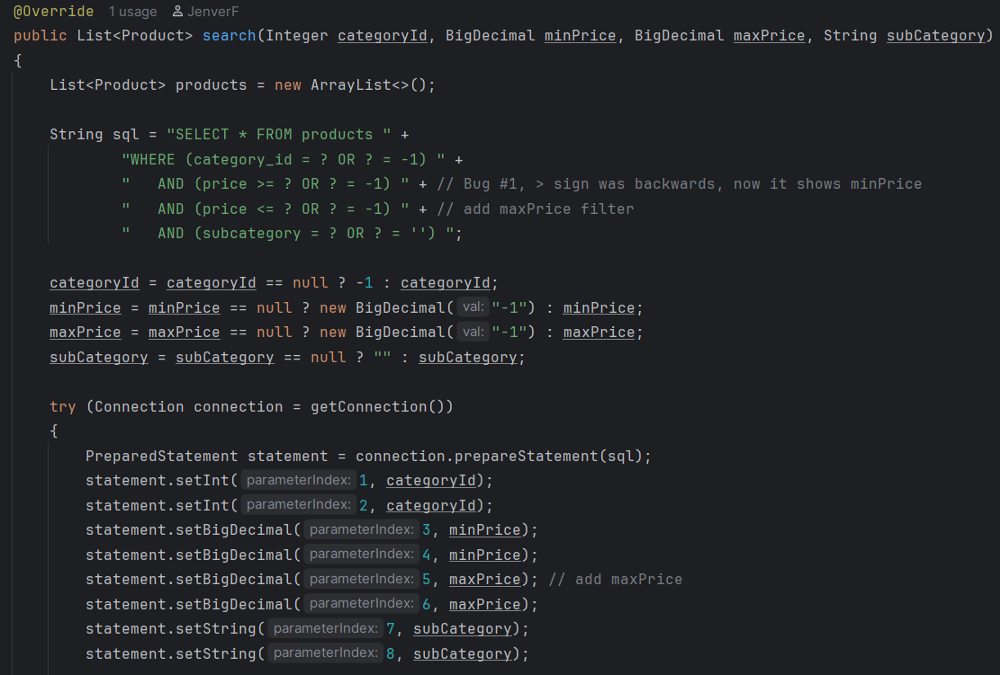
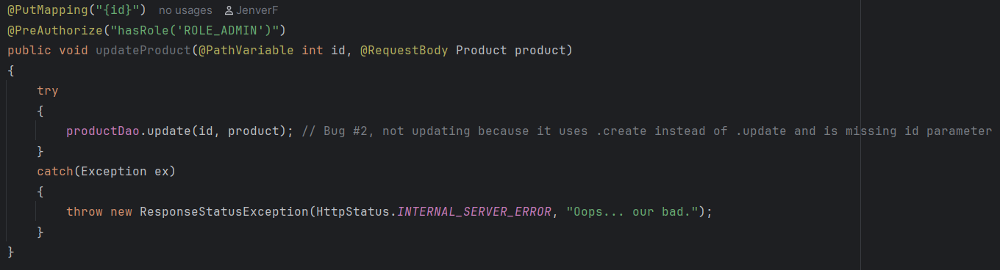
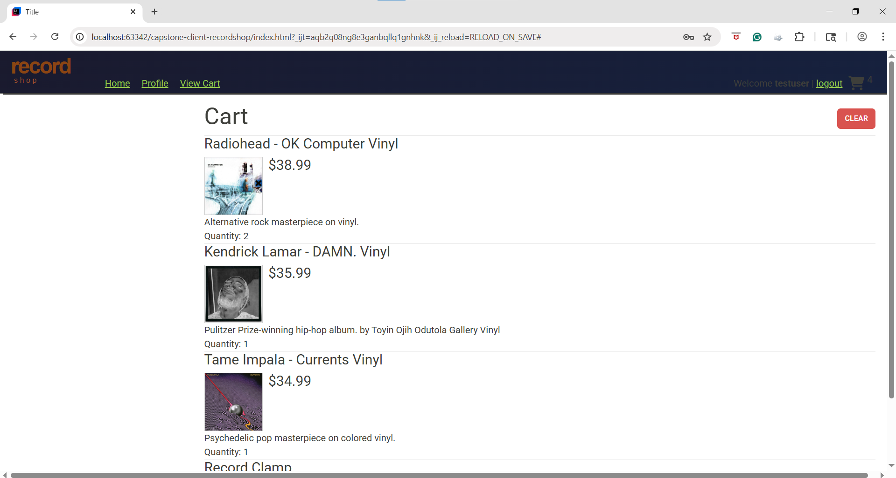

# 💿🎵 Jenver's Record Store 🎵💿

This project is a full-stack e-commerce application built as a capstone project. It provides a RESTful API and a client-facing website for browsing vinyl records, managing products, handling user authentication, and supporting shopping cart functionality.

The application demonstrates backend development using Java, Spring Boot, and MySQL, along with frontend integration using a static website that consumes the API.

---


## 📌 Features

---

### 🔐 Authentication
- `POST http://localhost:8080/register`: User registration using JWT-based authentication
- `POST http://localhost:8080/login`: Login using JWT-based authentication
- Role-based access control for users and administrators

### 💸 Product Operations
- `GET http://localhost:8080/products`: Browse all products
- `GET http://localhost:8080/products/{id}`: Search and filter products by category, price range, and sub category
- Full CRUD operations for products and categories (Admin-only)

### 🛒 Shopping Cart
- Add, update, view, and clear items in shopping cart
- Shopping cart data is tied to user accounts
- `GET http://localhost:8080/cart`
- `POST http://localhost:8080/cart/products/{productId}`
- `PUT http://localhost:8080/cart/products/{productId}`
- `DELETE http://localhost:8080/cart`

### 👤 User Profile
- TBD

### 🐛 Bug fixes
- Improved product search accuracy
- Fixed issues related to price filtering
- Prevented duplicated products during updates

---

## 🌚 Phases Overview

---
### 🌘 Phase #1 - CategoriesController
Implemented RESTful API endpoints to manage products categories with full CRUD functionality:
- `GET http://localhost:8080/categories`: Retrieve all categories
- `GET http://localhost:8080/categories/{id}`: Retrieve a category by id
- `POST http://localhost:8080/categories/{id}`: Add a new category (Admin-only)
- `PUT http://localhost:8080/categories/{id}`: Update a category (Admin-only)
- `DELETE http://localhost:8080/categories/{id}`: Delete a category (Admin-only)

---
### 🌗 Phase #2 - Bug Fixes 🐛
**BUG #1 🐞**: Users have reported that the product search functionality is returning incorrect results.

**How I fixed it**: Corrected inaccurate product search results by improving SQL query logic and properly handling query parameters.



---

**BUG #2 🕷**: Some users have also noticed that some of the products seem to be duplicated. For example, a laptop is listed 3 times, and it appears to be the same product, but there are slight differences, such as the description or the price. If you look at the 3 laptops you notice that they are the same product. This laptop has been edited twice, the first time you updated the price, the second update was to the description. It appears that instead of updating the product, each time you tried to update, it added a new product to the database.

**How I fixed it**: Resolved duplication issues during product updates by ensuring existing products are updated instead of creating entries.



---
### 🌖 Phase 3 - Shopping Cart
Developed Shopping Cart features which allows users to:
- Add products to cart
- View current cart
- Update product quantities
- Clear their cart


---

## 🧠 Interesting Piece of Code:
``` java
// Helper method so I don't have to type all product entries
    protected static Product mapRow(ResultSet row) throws SQLException
    {
        int productId = row.getInt("product_id");
        String name = row.getString("name");
        BigDecimal price = row.getBigDecimal("price");
        int categoryId = row.getInt("category_id");
        String description = row.getString("description");
        String subCategory = row.getString("subcategory");
        int stock = row.getInt("stock");
        boolean isFeatured = row.getBoolean("featured");
        String imageUrl = row.getString("image_url");

        return new Product(productId, name, price, categoryId, description, subCategory, stock, isFeatured, imageUrl);
    }
```

Why it's interesting: It's a helper method for writing the ResultSet for each method without actually writing every quality of that product and makes each method a lot cleaner and easier to look at.

Example of it being used:

``` java
// Add product to users cart by user id
    @Override
    public ShoppingCart getByUserId(int userId) {
        ShoppingCart cart = new ShoppingCart();
        String query = """
                SELECT sc.product_id, sc.quantity, p.name, p.price, p.category_id, p.description,
                    p.subcategory, p.image_url, p.stock, p.featured
                FROM shopping_cart as sc
                INNER JOIN products as p
                    ON sc.product_id = p.product_id
                WHERE user_id = ?;""";

        try(Connection connection = dataSource.getConnection();
            PreparedStatement preparedStatement = connection.prepareStatement(query);
        ) {
            preparedStatement.setInt(1, userId);

            try(ResultSet resultSet = preparedStatement.executeQuery()) {
                while (resultSet.next()) {
                    Product product = mapRow(resultSet);
                    ShoppingCartItem cartItem = new ShoppingCartItem();
                    cartItem.setProduct(product);
                    cartItem.setQuantity(resultSet.getInt("quantity"));

                    cart.add(cartItem);
                }
            }

        } catch (SQLException e) {
            throw new RuntimeException(e);
        }
        return cart;
    }
```
---

## 📘 Author

**Jenver Fernandez**

📍 Seattle, Washington

## 👥 References

Van Putten, M. (2025). LTCA Instructor Year Up United.

OpenAI. (2025). ChatGPT (GPT-5) [Large language model]. https://chat.openai.com/ README.md file assistance

---